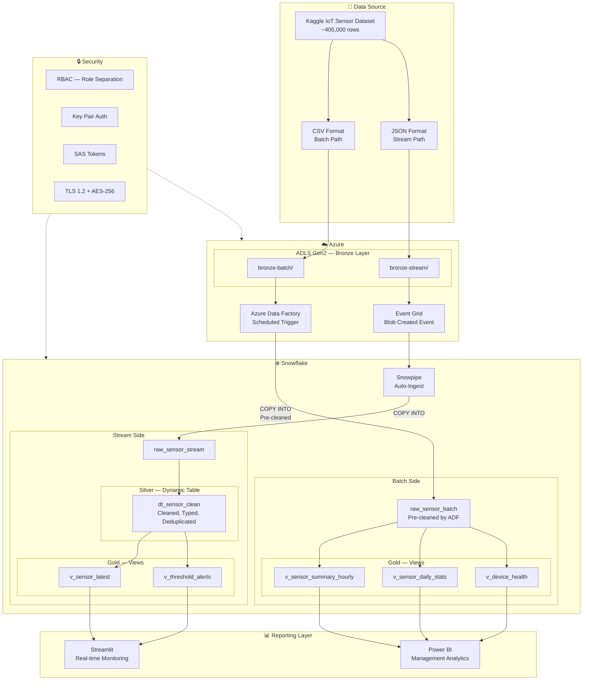
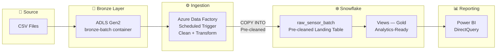

# Azure Snowflake IoT Pipeline

Cloud data pipeline built on Azure and Snowflake with Medallion architecture — supporting both batch CSV ingestion via Azure Data Factory and real-time JSON stream ingestion via Snowpipe, with Power BI and Streamlit as the reporting layer.

---

> **NOTICE: Self-Learning Project**
>
> This project was built independently to develop hands-on cloud data engineering skills
> before transitioning from on-premises manufacturing data platforms to cloud-based architecture.
>
> The repository contains:
> - Architecture design and rationale
> - Pipeline walkthrough (batch and stream paths)
> - Snowflake object design (stages, pipes, Dynamic Tables, Views)
> - Security design (RBAC, key pair auth, SAS tokens)
> - Medallion architecture implementation details
> - Dashboard and reporting layer design
>
> **Dataset:** Kaggle — IoT Environmental Sensor Telemetry (~405,000 rows)

---

## Table of Contents

1. [Why I Built This](#1-why-i-built-this)
2. [Overview](#2-overview)
3. [Architecture](#3-architecture)
4. [Dataset](#4-dataset)
5. [Medallion Architecture](#5-medallion-architecture)
6. [Pipeline Walkthrough](#6-pipeline-walkthrough)
7. [Snowflake Design](#7-snowflake-design)
8. [Security Design](#8-security-design)
9. [Reporting Layer](#9-reporting-layer)
10. [What I Would Change in Production](#10-what-i-would-change-in-production)
11. [Key Learnings](#11-key-learnings)
12. [Tech Stack](#12-tech-stack)

---

## 1. Why I Built This

### Background

I've spent nearly three years as a data engineer in automotive manufacturing at Thai Summit PK Corporation in Rayong, Thailand. My day-to-day work involves building real-time ETL pipelines, designing Kimball star schema data models on SQL Server, computing SPC metrics (PPK, PP, UCL/LCL), and delivering Power BI and Grafana dashboards from shop floor inspection data.

Everything I've built has been **on-premises** — Python scripts reading Excel files from camera inspection stations, loading into SQL Server, and serving dashboards to QC teams and management.

It works. But I knew the next step in my career required **cloud experience** — not just watching tutorials or reading documentation, but actually building something end-to-end with real cloud services, real data, and real architecture decisions.

### The Goal

Build what I would build if my company asked me to migrate our data platform to the cloud tomorrow.

That means:
- A proper **landing zone** for raw data (not just dumping files into a folder)
- Both **batch and stream ingestion** paths (because manufacturing needs both)
- A **transformation layer** that cleans and structures data incrementally
- A **reporting layer** that serves different audiences (real-time monitoring vs management analytics)
- **Security** designed from the start, not bolted on after

### Why This Dataset

I chose the IoT Environmental Sensor Telemetry dataset from Kaggle because it mirrors what I work with in manufacturing — high-frequency sensor readings (temperature, humidity, CO, LPG, smoke, light, motion) that need to be ingested reliably, cleaned, and made available for monitoring and analysis.

The engineering principles are identical to what I do with CMM inspection data and PLC signals on the factory floor. The only difference is the source — instead of machines on a production line, it's IoT sensors. The pipeline design, data modeling, and architecture decisions are the same.

---

## 2. Overview

### What This Pipeline Does

```
Raw sensor data → Cloud storage → Ingestion (batch + stream) → Transformation → Analytics-ready → Dashboards
```

The pipeline takes raw IoT sensor data in two formats:
- **CSV files** — batch ingestion on a schedule (simulating end-of-shift data dumps)
- **JSON files** — stream ingestion in near-real-time (simulating live sensor feeds)

Both paths land in Snowflake, get cleaned and transformed through Medallion layers (Bronze → Silver → Gold), and serve analytics-ready data to **Power BI** dashboards and a **Streamlit** web application.

### Key Numbers

| Item | Value |
|------|-------|
| Total rows | ~405,000 |
| Sensor types | 7 (temperature, humidity, CO, LPG, smoke, light, motion) |
| Ingestion paths | 2 (batch CSV via ADF, stream JSON via Snowpipe) |
| Medallion layers | 3 (Bronze, Silver, Gold) |
| Reporting tools | 2 (Power BI, Streamlit) |

---

## 3. Architecture

### Architecture Diagram



### How It Works

The system has two parallel ingestion paths that converge in Snowflake:

**Batch Path (CSV):**
```
CSV files → ADLS Gen2 (Bronze container) → Azure Data Factory (scheduled, clean + transform) → Snowflake Landing Table (pre-cleaned) → Views (Gold) → Power BI
```

**Stream Path (JSON):**
```
JSON files → ADLS Gen2 (Bronze container) → Snowpipe (auto-ingest via Event Grid) → Snowflake Landing Table → Dynamic Tables (Silver) → Views (Gold) → Streamlit
```

Both paths end at Gold layer Views, but the cleaning happens at different stages — ADF handles it for batch before data reaches Snowflake, while Dynamic Tables handle it for stream inside Snowflake.

### Why Two Paths?

In manufacturing, you need both patterns:

| Pattern | Manufacturing Example | This Project |
|---------|----------------------|--------------|
| **Batch** | End-of-shift quality summaries, daily OEE reports, weekly management reports | ADF picks up CSV files on schedule |
| **Stream** | Real-time machine alerts, live sensor monitoring, SPC control charts | Snowpipe auto-ingests JSON as files land |

Building both proves I can handle the full spectrum — from scheduled reporting to near-real-time monitoring.

---

## 4. Dataset

**Source:** [Kaggle — IoT Environmental Sensor Telemetry](https://www.kaggle.com/datasets/garystafford/environmental-sensor-data-132k)

**Volume:** ~405,000 rows

**Format:** CSV (original), converted to JSON for stream path testing

### Fields

| Field | Description | Type |
|-------|-------------|------|
| ts | Timestamp of reading | datetime |
| device | Device identifier | string |
| co | Carbon monoxide level | float |
| humidity | Relative humidity (%) | float |
| light | Light detected (boolean) | boolean |
| lpg | Liquefied petroleum gas level | float |
| motion | Motion detected (boolean) | boolean |
| smoke | Smoke level | float |
| temp | Temperature (°F) | float |

### Why This Dataset Works

| Manufacturing Parallel | IoT Dataset Equivalent |
|----------------------|----------------------|
| CMM measurement values with spec limits | Sensor readings with threshold alerts |
| Multiple inspection stations per line | Multiple devices reporting simultaneously |
| 24/7 production generating continuous data | Continuous sensor telemetry stream |
| Need to detect drift and anomalies | Need to detect threshold breaches |
| Historical trend analysis for process improvement | Historical trend analysis for environmental monitoring |

---

## 5. Medallion Architecture

### Why Medallion?

In my on-premises work, I already structure data in layers — raw ingestion tables, cleaned staging, and final star schema views for Power BI. Medallion is the cloud-native version of the same thinking.

I chose Medallion because it enforces a discipline that prevents the most common data platform failure: dumping everything into one table and hoping for the best.

### Layer Design

```mermaid
flowchart LR
    subgraph BRONZE["🥉 Bronze — Raw"]
        direction TB
        B1[ADLS Gen2]
        B2[Untouched raw data]
        B3[Single source of truth]
        B4[CSV + JSON formats]
    end

    subgraph SILVER["🥈 Silver — Cleaned"]
        direction TB
        S1[Snowflake Dynamic Tables]
        S2[Type casting]
        S3[NULL handling]
        S4[Deduplication]
        S5[Validation]
    end

    subgraph GOLD["🥇 Gold — Analytics-Ready"]
        direction TB
        G1[Snowflake Views]
        G2[Hourly summaries]
        G3[Latest readings]
        G4[Threshold alerts]
        G5[Daily statistics]
    end

    BRONZE -->|Incremental<br/>Refresh| SILVER -->|Lightweight<br/>Aggregation| GOLD
```




#### Bronze — Raw Landing Zone (ADLS Gen2)

```
adls-gen2-account/
├── bronze-batch/          ← CSV files from ADF
│   ├── 2024-01-15/
│   │   ├── sensor_data_001.csv
│   │   └── sensor_data_002.csv
│   └── 2024-01-16/
│       └── sensor_data_003.csv
└── bronze-stream/         ← JSON files for Snowpipe
    ├── event_001.json
    ├── event_002.json
    └── event_003.json
```

**Rules:**
- Raw data lands here **untouched** — no transformation, no filtering, no deduplication
- This is the single source of truth — if anything breaks downstream, I can always reprocess from Bronze
- Organized by date for batch, flat for stream (Snowpipe handles ordering)
- Retention: keep everything (storage is cheap, reprocessing is expensive)

#### Silver — Cleaned and Validated (Snowflake Dynamic Tables — Stream Path Only)

Silver is where **stream data** gets cleaned. Dynamic Tables handle this incrementally — only processing new rows, not rescanning the full table every time.

Batch data skips this layer because ADF already handles cleaning during ingestion — there's no point cleaning twice.

**Transformations applied:**
- Data type casting (strings → proper floats, timestamps)
- NULL handling (drop rows where critical fields are missing)
- Deduplication (same device + same timestamp = duplicate)
- Validation (reject physically impossible values — e.g., temperature < -100°F)
- Standardization (consistent column naming, timezone normalization)

**Why Dynamic Tables instead of dbt?**

Dynamic Tables are Snowflake-native. They handle incremental transformation automatically without needing an external orchestrator. For a pipeline this size, adding dbt would be overengineering. Dynamic Tables let me define the transformation as a SQL query and Snowflake handles when and how to refresh — similar to a materialized view but with built-in dependency tracking.

If this were a larger enterprise pipeline with 50+ models and complex cross-domain joins, I would consider dbt. For this use case, Dynamic Tables are the right tool.

#### Gold — Analytics-Ready (Snowflake Views)

Gold layer serves specific reporting needs through Views built on top of Silver:

| View | Purpose | Consumer |
|------|---------|----------|
| `v_sensor_summary_hourly` | Hourly aggregated sensor averages per device | Power BI |
| `v_sensor_latest` | Most recent reading per device | Streamlit (real-time) |
| `v_threshold_alerts` | Readings that exceed defined thresholds | Streamlit (alerts) |
| `v_sensor_daily_stats` | Daily min/max/avg/stddev per sensor type | Power BI |
| `v_device_health` | Device uptime and reading frequency | Power BI |

**Why Views instead of more Dynamic Tables?**

Gold layer aggregations are lightweight — they don't need materialization because the Silver Dynamic Tables have already done the heavy lifting. Views keep the Gold layer flexible and zero-maintenance. If a reporting requirement changes, I update the View definition and it takes effect immediately — no refresh cycle, no storage cost.

---

## 6. Pipeline Walkthrough

### Batch Path — Azure Data Factory




#### How It Works

| Step | Component | What Happens |
|------|-----------|-------------|
| 1 | ADF Trigger | Scheduled trigger fires (configurable — hourly, daily, etc.) |
| 2 | ADF Pipeline | Picks up new CSV files from ADLS Gen2 Bronze container |
| 3 | ADF Data Flow | Cleans, transforms, and validates data before loading |
| 4 | Copy Activity | Loads pre-cleaned data into Snowflake landing table via COPY INTO |
| 5 | Views | Gold layer Views read directly from landing table |
| 6 | Power BI | DirectQuery reads from Gold Views |

#### ADF Pipeline Design

The ADF pipeline is intentionally simple — one pipeline, one copy activity. In production with multiple data sources, I would add:
- Lookup activities for incremental loading (only new files)
- Error handling with routing failed files to an error container
- Pipeline monitoring and alerting via Azure Monitor
- Parameterized pipelines for multi-source reuse

For this project, the goal was to prove the ADF → Snowflake connection works end-to-end, not to build an enterprise orchestration layer.

#### Why ADF Instead of Just Snowpipe for Everything?

Snowpipe is event-driven — it reacts to files landing. ADF is orchestration-driven — it runs on schedule and can do more than just copy data. In a production environment:

| Scenario | Better Tool |
|----------|-------------|
| Files land continuously, need near-real-time | Snowpipe |
| Files land once per shift, need batch processing | ADF |
| Need to pull data from API or database (not files) | ADF |
| Need retry logic, error routing, dependency chains | ADF |
| Simple file → table ingestion | Either works |

Having both in this project demonstrates I understand when to use each.

### Stream Path — Snowpipe

```mermaid
flowchart LR
    subgraph SOURCE["📁 Source"]
        JSON[JSON Files]
    end

    subgraph BRONZE["🥉 Bronze Layer"]
        ADLS2[ADLS Gen2<br/>bronze-stream container]
    end

    subgraph TRIGGER["⚡ Event Trigger"]
        EG[Azure Event Grid<br/>Blob Created Event]
    end

    subgraph SNOWFLAKE["❄️ Snowflake"]
        PIPE[Snowpipe<br/>Auto-Ingest]
        RAW2[raw_sensor_stream<br/>Landing Table]
        SILVER2[dt_sensor_clean<br/>Dynamic Table — Silver]
        GOLD2[Views — Gold]
    end

    subgraph REPORTING["📊 Reporting"]
        ST[Streamlit<br/>Real-time App]
    end

    JSON --> ADLS2
    ADLS2 -->|Blob Event| EG
    EG -->|Notification| PIPE
    PIPE -->|COPY INTO| RAW2
    RAW2 -->|Incremental Refresh| SILVER2
    SILVER2 --> GOLD2
    GOLD2 --> ST
```




#### How It Works

| Step | Component | What Happens |
|------|-----------|-------------|
| 1 | File lands | JSON file dropped into ADLS Gen2 Bronze stream container |
| 2 | Event Grid | Azure Event Grid detects new blob and sends notification |
| 3 | Snowpipe | Snowpipe receives notification and triggers auto-ingest |
| 4 | COPY INTO | Snowpipe loads JSON into Snowflake landing table (~1-2 min latency) |
| 5 | Dynamic Table | Silver layer picks up new rows incrementally |
| 6 | Views | Gold layer reflects updated data |
| 7 | Streamlit | App queries Gold Views for latest readings |

#### Snowpipe Configuration

The Snowpipe setup involves three components working together:

**1. External Stage** — Points Snowflake to the ADLS Gen2 container:
```
Stage → ADLS Gen2 bronze-stream container (authenticated via SAS token)
```

**2. File Format** — Defines how to parse incoming JSON:
```
JSON format → strip outer array, handle NULLs, date/timestamp format
```

**3. Pipe** — Defines the auto-ingest behavior:
```
Pipe → watches stage → auto-ingest ON → COPY INTO landing table
```

#### Snowpipe Latency

Snowpipe is **not true real-time** — it is near-real-time micro-batch. Typical latency is 1-2 minutes from file landing to data being queryable in Snowflake.

For most manufacturing monitoring use cases (SPC charts, OEE dashboards, shift reports), this is acceptable. If sub-second latency is required (e.g., emergency shutoff triggers), Snowpipe Streaming via Kafka connector or direct API integration would be needed — see Section 10.

---

## 7. Snowflake Design

### Object Overview

| Object | Type | Purpose |
|--------|------|---------|
| `stg_ext_adls_batch` | External Stage | Points to ADLS Gen2 batch container |
| `stg_ext_adls_stream` | External Stage | Points to ADLS Gen2 stream container |
| `ff_csv_sensor` | File Format | Parses CSV sensor data |
| `ff_json_sensor` | File Format | Parses JSON sensor events |
| `pipe_sensor_stream` | Snowpipe | Auto-ingest for JSON stream path |
| `raw_sensor_batch` | Table | Landing table for batch CSV data (pre-cleaned by ADF) |
| `raw_sensor_stream` | Table | Landing table for stream JSON data (raw) |
| `dt_sensor_clean` | Dynamic Table | Silver — cleans stream data only (typed, deduplicated) |
| `v_sensor_summary_hourly` | View | Gold — hourly aggregation (reads from batch) |
| `v_sensor_latest` | View | Gold — latest reading per device (reads from stream Silver) |
| `v_threshold_alerts` | View | Gold — threshold breach alerts (reads from stream Silver) |
| `v_sensor_daily_stats` | View | Gold — daily statistics (reads from batch) |
| `v_device_health` | View | Gold — device uptime monitoring (reads from batch) |

### Why Different Transformation Strategies?

The batch and stream paths handle cleaning differently:

| Aspect | Batch Path | Stream Path |
|--------|-----------|-------------|
| **Where cleaning happens** | ADF (before Snowflake) | Dynamic Table (inside Snowflake) |
| **Why** | ADF Data Flow can transform during copy — no need to land raw then clean again | Snowpipe does COPY INTO only — cannot transform during ingestion |
| **Landing table state** | Pre-cleaned, typed, validated | Raw JSON, needs parsing and cleaning |
| **Path to Gold** | Landing table → Views directly | Landing table → Dynamic Table (Silver) → Views |

This is a deliberate design choice — use each tool's strength. ADF is an orchestrator that can transform. Snowpipe is a loader that just copies. So the cleaning logic lives where it makes sense.

### Dynamic Table Refresh (Stream Path Only)

Dynamic Tables in Snowflake have a configurable refresh lag — the maximum allowed staleness before Snowflake triggers an incremental refresh.

For this project:
- Silver Dynamic Table (`dt_sensor_clean`): **5 minute** target lag
- Only applies to the stream path — batch data is already clean when it lands

The key advantage over traditional ETL scheduling is that Dynamic Tables are **dependency-aware** — if upstream data hasn't changed, they don't recompute. This eliminates wasted compute cycles.

---

## 8. Security Design

Security was designed from the start, not added after the pipeline was running. In manufacturing environments, data access control is non-negotiable — production data, quality metrics, and process parameters are all sensitive.

### RBAC — Role-Based Access Control

Snowflake RBAC separates access by function:

| Role | Access | Purpose |
|------|--------|---------|
| `role_ingest` | Write to Bronze tables only | ADF and Snowpipe service connections |
| `role_transform` | Read Bronze, Write Silver | Dynamic Table refresh (managed by Snowflake) |
| `role_report` | Read Gold Views only | Power BI and Streamlit connections |
| `role_admin` | Full access | Schema changes, monitoring, troubleshooting |

**Why this matters:**
- The reporting layer **cannot** accidentally write to or corrupt raw data
- The ingestion layer **cannot** read transformed data or other tables
- If a Power BI credential is compromised, the attacker only sees Gold Views — not raw data or Bronze tables
- Principle of least privilege applied at every layer

### Key Pair Authentication

ADF and Snowpipe connect to Snowflake using **RSA key pair authentication**, not passwords.

**Why key pairs instead of passwords:**
- No credential stored in plain text anywhere in the pipeline
- Key rotation can be automated without changing pipeline configuration
- No risk of password leakage through logs, error messages, or configuration files
- This is Snowflake's recommended approach for service-to-service connections

**How it works:**
```
Generate RSA key pair → Register public key in Snowflake → Store private key in ADF/Snowpipe config → Authentication happens via key exchange, no password transmitted
```

### SAS Tokens — Scoped Access

ADLS Gen2 access is controlled through **Shared Access Signature (SAS) tokens**:

- Scoped to **specific containers** (not the entire storage account)
- **Time-limited** — tokens expire and must be rotated
- **Read-only** for Snowflake external stages (Snowflake only needs to read, never write to ADLS)
- **Write access** only for ADF (which writes batch output to Bronze)

### Encryption

| Layer | Encryption |
|-------|-----------|
| ADLS Gen2 at rest | Azure-managed keys (AES-256) |
| Snowflake at rest | AES-256 (managed by Snowflake) |
| Data in transit | TLS 1.2 for all connections |
| ADF ↔ Snowflake | Encrypted connection via Snowflake connector |
| Snowpipe ↔ ADLS | Encrypted via SAS token over HTTPS |

---

## 9. Reporting Layer

### Power BI — Management Analytics


Connected to Snowflake Gold layer Views using Snowflake's native Power BI connector in DirectQuery mode.

**Dashboard pages:**

| Page | Purpose | Data Source |
|------|---------|------------|
| Sensor Overview | Current status of all devices, latest readings | `v_sensor_latest` |
| Trend Analysis | Historical sensor trends with time filters | `v_sensor_summary_hourly` |
| Alert History | Threshold breaches over time | `v_threshold_alerts` |
| Device Health | Uptime, reading frequency, data gaps | `v_device_health` |

**Why DirectQuery instead of Import?**
- Data stays in Snowflake — no duplication, no stale copies
- Dashboard always shows current data
- Snowflake handles the query compute, not Power BI
- Trade-off: slightly slower dashboard interaction, but freshness is more important for operational monitoring

### Streamlit — Real-Time Monitoring


A lightweight Python web application connected directly to Snowflake using the Snowflake Python connector.

**Features:**
- **Live readings** — shows most recent sensor values per device
- **Trend charts** — interactive time-series plots with Plotly
- **Threshold alerts** — highlighted rows when readings exceed defined limits
- **Auto-refresh** — page refreshes at configurable interval

**Why Streamlit instead of just Power BI?**

| Aspect | Power BI | Streamlit |
|--------|----------|-----------|
| Audience | Management, weekly review | QC team, real-time monitoring |
| Refresh | DirectQuery (on interaction) | Auto-refresh (configurable interval) |
| Customization | Limited to Power BI visuals | Full Python control |
| Hosting | Power BI Service (Microsoft) | Can run on any server |
| Cost | Requires Power BI Pro licence | Free (open source) |

In a manufacturing context, Streamlit is closer to what a Grafana dashboard does — lightweight, always-on, built for the shop floor. Power BI is for the office.

---

## 10. What I Would Change in Production

This project was built as a proof of concept on a public dataset. In a real manufacturing deployment, I would change the following:

| This Project | Production Version | Why |
|---|---|---|
| Kaggle CSV/JSON files | Azure IoT Hub or Event Hubs | Live sensor data needs a proper ingestion service, not file drops |
| File-based Snowpipe | Snowpipe Streaming via Kafka connector | True streaming instead of file-triggered micro-batch |
| Single Snowflake database | Separate databases per environment (dev/staging/prod) | Environment isolation for safe testing |
| Manual deployment | Infrastructure as code (Terraform or ARM templates) | Reproducible, version-controlled infrastructure |
| SAS token for stage | Azure Managed Identity | Eliminates token management entirely |
| Single security boundary | Network policies + Private Link | Snowflake and ADLS communicate over private network, not public internet |
| Power BI + Streamlit | Add Grafana for real-time, keep Power BI for management | Grafana is purpose-built for real-time industrial monitoring |
| No alerting | Azure Monitor + Snowflake alerts | Automated notifications when pipeline fails or data quality drops |
| No data quality framework | Great Expectations or Snowflake data quality checks | Automated validation at each Medallion layer transition |

### Production Architecture (Conceptual)

```
IoT Sensors / PLCs / SCADA
        ↓
Azure IoT Hub / Event Hubs
        ↓
Kafka Connector
        ↓
Snowpipe Streaming → Snowflake (Bronze)
        ↓
Dynamic Tables (Silver) — with data quality checks
        ↓
Views / Dynamic Tables (Gold)
        ↓
Grafana (real-time shop floor) + Power BI (management)
```

This is the architecture I would propose after establishing trust and understanding the existing systems at a new organization — not on day one, but after 3-6 months of building quick wins with SQL Server and Power BI first.

---

## 11. Key Learnings

### Medallion Is Not Just a Folder Structure

Each layer has a specific contract:
- **Bronze** is append-only raw data — never modify, never delete
- **Silver** is validated and typed — this is where bad data gets caught
- **Gold** is business-logic applied — shaped for specific reporting needs

Skipping Silver or mixing concerns between layers creates the same mess you get with unstructured on-premises databases where everything lives in one schema with no separation between raw and clean data.

### Snowpipe Is Not True Real-Time

Snowpipe is near-real-time micro-batch — typically 1-2 minute latency from file landing to data being queryable. For most manufacturing monitoring use cases (SPC charts, OEE dashboards, shift reports), this is acceptable.

For sub-second requirements (emergency shutoff, real-time machine control), you need Snowpipe Streaming or direct Kafka integration. This is an important distinction to understand before promising "real-time" to stakeholders.

### Dynamic Tables Simplify Incremental Processing

Instead of writing custom merge logic or maintaining dbt models, Dynamic Tables handle change tracking internally. The trade-off is less flexibility — but for straightforward cleansing and aggregation, they are excellent.

The decision point: if your transformation logic fits in a single SQL query, Dynamic Tables are likely the right tool. If you need complex multi-step transformations with conditional logic, testing frameworks, and documentation, dbt is worth the overhead.

### Security Should Be Designed First

Setting up RBAC, key pair auth, and scoped SAS tokens from the beginning is far easier than retrofitting them after the pipeline is already running with admin credentials. Every service connection should have the minimum permissions it needs — ingestion writes to Bronze, reporting reads from Gold, and nothing crosses those boundaries.

### Cloud Doesn't Replace Architecture Thinking

Moving to the cloud doesn't automatically solve data platform problems. A poorly designed cloud pipeline fails in exactly the same ways as a poorly designed on-premises pipeline — just with higher monthly bills. The Kimball modeling, data validation, and separation of concerns that I practice on SQL Server apply directly to Snowflake. The tools change, the principles don't.

---

## 12. Tech Stack

| Layer | Technology |
|---|---|
| Cloud Storage | Azure Data Lake Storage Gen2 (ADLS Gen2) |
| Batch Ingestion | Azure Data Factory (ADF) |
| Stream Ingestion | Snowpipe (auto-ingest via Azure Event Grid) |
| Data Platform | Snowflake |
| Transformation | Snowflake Dynamic Tables |
| Reporting (Gold) | Snowflake Views |
| Dashboard — Analytics | Power BI (DirectQuery) |
| Dashboard — Real-time | Streamlit |
| Security | RBAC, RSA Key Pair Auth, SAS Tokens, TLS 1.2, AES-256 |
| Language | Python, SQL |
| Dataset | Kaggle IoT Environmental Sensor Telemetry (~405K rows) |

---

## Screenshots

> Add images to the `images/` folder in this repository:
>
> | Filename | Description |
> |----------|-------------|
> | `adf_pipeline.png` | Azure Data Factory pipeline in Azure portal |
> | `snowflake_objects.png` | Snowflake console showing tables, stages, pipes |
> | `powerbi.png` | Power BI dashboard screenshot |
> | `streamlit.png` | Streamlit app screenshot |

---

## Author

**Kittipong Sangmuang (Pume)**
Data & Automation Engineer | Rayong, Thailand

[](https://linkedin.com/in/)
[](https://github.com/KSangmuang)
